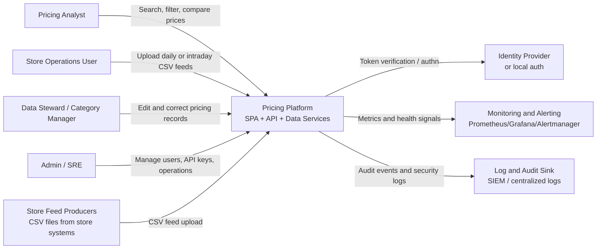

# 1) Context Diagram

## Objective

Show how the Pricing Platform interacts with users and external systems in the enterprise landscape.

## Context diagram (C4 level 1)

## System boundary

- Included:
  - Ingestion API for CSV upload
  - Search API and query service
  - Record update API with audit trail
  - SPA for upload/search/edit workflows
- Excluded:
  - Upstream ERP/POS generation logic
  - Downstream repricing engine (can be integrated later)
