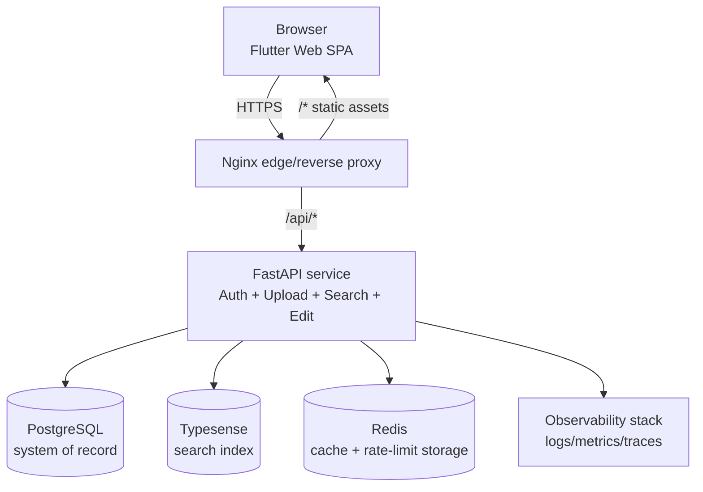

# 2) Solution Architecture

## Architecture summary

The platform uses a decoupled web architecture:

- SPA frontend for user workflows
- API tier for auth, ingestion, query, and updates
- OLTP database as source of truth
- Search index optimized for low-latency discovery
- Cache tier for high-read paths and metadata
- Kubernetes-ready deployment model

## Container view (C4 level 2)

## Logical flow by requirement

### A) CSV upload and persistence

1. User uploads CSV in SPA
2. API validates schema and file size
3. Rows are parsed in chunks and normalized
4. Records are upserted to Postgres
5. Canonical records are synchronized into Typesense
6. Upload metadata and status are persisted for traceability

### B) Search by criteria

1. User applies criteria (`q`, `store_id`, `sku`, `date range`, pagination)
2. API queries Typesense for ranked/faceted results
3. IDs are re-hydrated from Postgres to maintain source-of-truth consistency
4. If search engine is unavailable, fallback query runs against Postgres

### C) Edit and save pricing record

1. User edits fields in SPA
2. API validates role-based authorization and payload
3. Record update is persisted in Postgres
4. Audit record is written with old/new values
5. Search index document is updated to preserve search consistency

## Deployment architecture

- Local/dev: Docker Compose
- Production: Kubernetes with Kustomize overlays (dev/staging/prod)
- GitOps CD: Argo CD application definitions
- CI/CD: GitHub Actions for PR checks, build, and promotions

## Data domains

- `pricing_records`: canonical price observations by store/SKU/date
- `pricing_feed_uploads`: ingestion manifest and status
- `pricing_record_audits`: immutable change history
- `users` and API keys: identity and role enforcement
